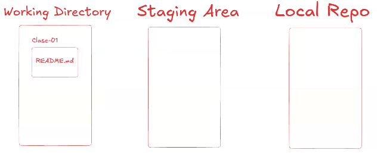

# Clase 02 - Git Desarrollo colaborativo

## Archivos del Working Directoru al Staging Areas

```sh
git add <nombre-archivo>
git add <nombre-archivo1> <nombre-archivo2>
git add . #No es tan recomendable

## Hacer un commit de lo que esta en el Staging Area

```sh
git commit # se va a abrir un edutor de texto para escribir el mensaje
git commir -m "Escribo un mensaje descriptivo sobre lo que se hizo"

## Recuperar rchivos de las diferentes zonas 

```sh
git restore . #Recupero todo. Me traigo todo lo que esta en el repo local al working directory. Si tengo archivos modificados pierdo las modificaciones.
git restore <archivo> <archivo1>
git restore --staged <archivo> # Me recupera los cambios marcados en el staging area al working directory.



#Subiendo repo local al remoto

```sh
git remote add <alias> <url-repositorio-git>
git remote add origin https://github.com/ansolisju/73563-git.git
````

# Borrar la irl del remoto en el repo local

```sh
git remote remove <alias>
git remote remove <origin>
```
